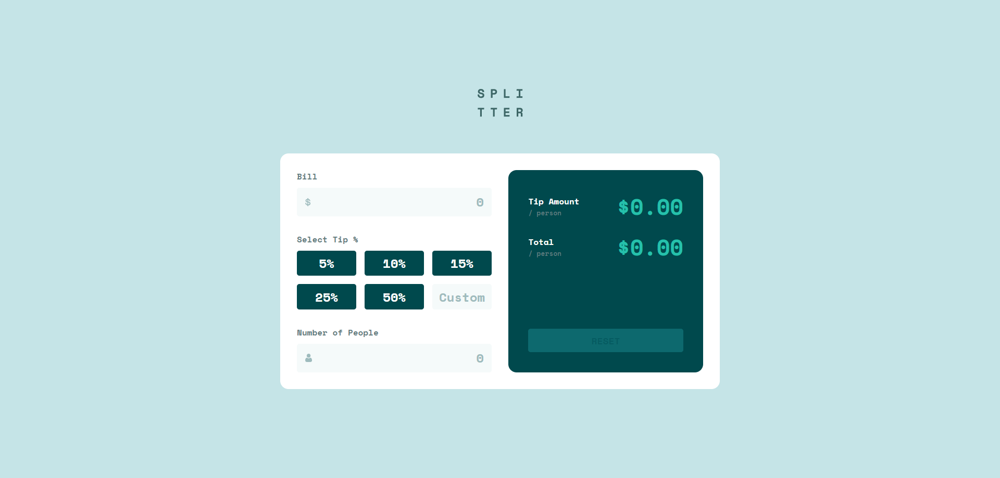

# Frontend Mentor - Tip calculator app solution

This is a solution to the [Tip calculator app challenge on Frontend Mentor](https://www.frontendmentor.io/challenges/tip-calculator-app-ugJNGbJUX). Frontend Mentor challenges help you improve your coding skills by building realistic projects.

## Table of contents

- [Overview](#overview)
  - [The challenge](#the-challenge)
  - [Screenshot](#screenshot)
  - [Links](#links)
- [My process](#my-process)
  - [Built with](#built-with)
  - [What I learned](#what-i-learned)
- [Author](#author)

## Overview

### The challenge

Users should be able to:

- View the optimal layout for the app depending on their device's screen size
- See hover states for all interactive elements on the page
- Calculate the correct tip and total cost of the bill per person

### Screenshot

### Links

- [Solution URL](https://github.com/Antonvasilache/tip-calculator-app)
- [Live Site URL](https://tip-calculator-ap-av.netlify.app/)

## My process

1. Creating the destktop layout.
2. Adding the active and completed states.
3. Adding the JavaScript functionality.
4. Making the layout responsive for smaller screens.

### Built with

- Semantic HTML5 markup
- CSS custom properties
- Flexbox
- CSS Grid

### What I learned

--Doing controlled inputs in vanilla JS

- Using JS for dynamic styles, where CSS might be too complicated

## Author

- Website - [Antonvasilache.com](https://www.antonvasilache.com)
- Frontend Mentor - [@Antonvasilache](https://www.frontendmentor.io/profile/Antonvasilache)
